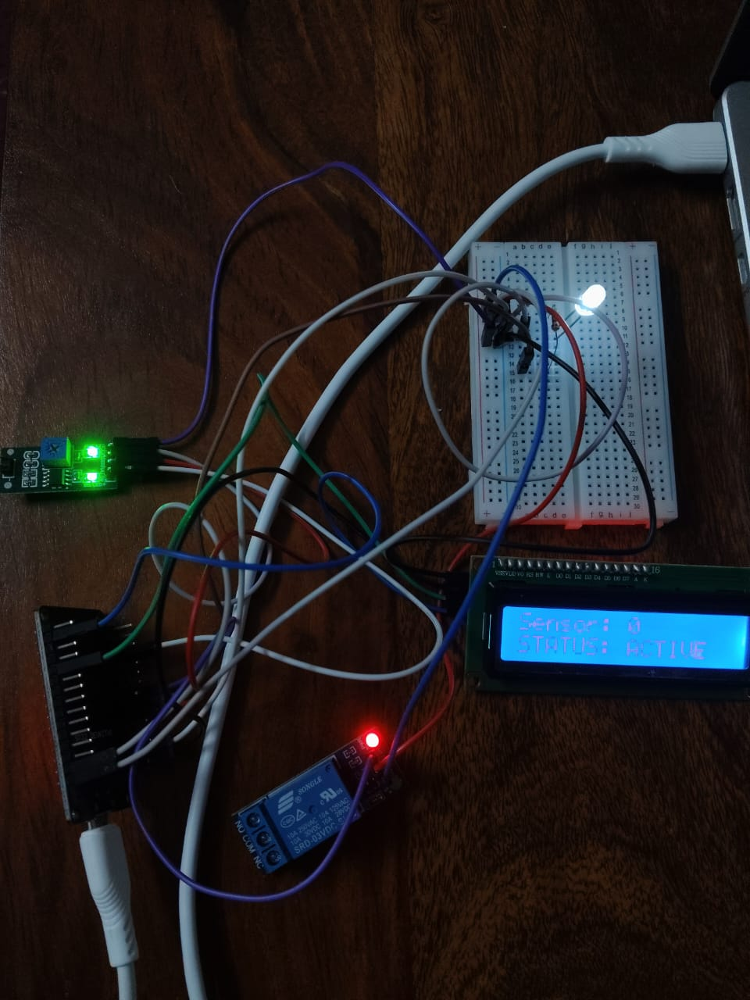
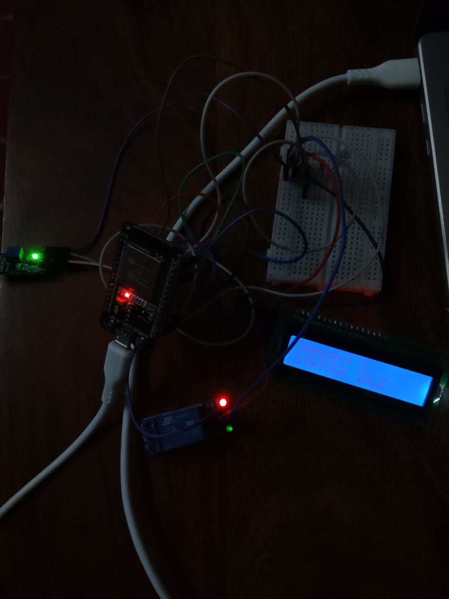

# ESP32 FreeRTOS-Based Multitasking and Hardware Control System

An ESP32-based real-time multitasking system developed using FreeRTOS and physically implemented and tested on hardware.

## Project Overview

This project demonstrates real-time embedded programming using FreeRTOS on an ESP32. Sensor data is collected periodically and distributed between multiple tasks using FreeRTOS queues.

The system controls an LED and relay based on the sensor state, displays the current status on an I2C LCD, and provides UART-based monitoring.

## Features

- FreeRTOS task-based architecture
- Sensor data acquisition
- Inter-task communication using FreeRTOS queues
- Mutex-based Serial resource protection
- Event Group synchronization
- I2C LCD display
- LED control
- Relay control
- UART monitoring
- Physical hardware implementation and testing

## Hardware Components

- ESP32 Development Board
- MH Sensor Module
- 16x2 I2C LCD
- 3.3V Relay Module (SONGLE SRD-03VDC-SL-C)
- LED
- 220 Ω Resistor
- Breadboard
- Jumper Wires
- USB Cable

## Pin Configuration

| Component | ESP32 Pin |
|---|---|
| Sensor Digital Output (DO) | GPIO 27 |
| Sensor Analog Output (AO) | GPIO 34 |
| LED | GPIO 26 |
| Relay IN | GPIO 25 |
| LCD SDA | GPIO 21 |
| LCD SCL | GPIO 22 |

## FreeRTOS Architecture

Sensor Task
    |
    +----> controlQueue ----> Control Task ----> LED
    |                                  |
    |                                  +--------> Relay
    |
    +----> displayQueue ---> LCD Task ----> I2C LCD
    |
    +----> Event Group

Sensor Task + Control Task
    |
    +----> Serial Mutex ----> UART Monitor

The Sensor Task signals new sensor data using an Event Group.

A mutex protects shared Serial output because both the Sensor Task and Control Task use Serial.

## FreeRTOS Objects

| Object | Purpose |
|---|---|
| Sensor Task | Reads sensor data |
| Control Task | Controls LED and relay |
| LCD Task | Updates LCD status |
| controlQueue | Sends sensor data to Control Task |
| displayQueue | Sends sensor data to LCD Task |
| serialMutex | Protects shared Serial output |
| lcdMutex | Protects LCD access |
| sensorEvents | Signals new sensor data |

## System Operation

1. ESP32 initializes UART, GPIO, I2C and LCD.
2. FreeRTOS queues, mutexes and Event Group are created.
3. Sensor, Control and LCD tasks are started.
4. Sensor Task reads the sensor digital and analog outputs.
5. Sensor data is sent to the Control and LCD tasks through queues.
6. Control Task uses the digital sensor state to control the LED and relay.
7. LCD Task displays the sensor state and system status.
8. UART provides real-time monitoring.
9. The Sensor Task repeats the sampling cycle approximately every 500 ms.

## Hardware Testing

The system was physically assembled and tested.

### Verified Functions

- Sensor digital state changes
- LED responds to sensor state
- Relay responds to sensor state
- LCD displays sensor status
- UART reports sensor readings
- FreeRTOS tasks operate correctly
- Serial output remains clean with mutex protection
- Extended stability testing completed

## Example UART Output

SENSOR | DO: 0 | AO: 4095
CONTROL | Sensor DO: 0 | LED: ON

SENSOR | DO: 1 | AO: 4095
CONTROL | Sensor DO: 1 | LED: OFF

## Technologies Used

- C / Embedded C
- ESP32
- FreeRTOS
- GPIO
- ADC
- UART
- I2C
- Queues
- Mutexes
- Event Groups
- Arduino IDE
- Git
- GitHub

## Embedded Concepts Demonstrated

- Real-time task management
- Inter-task communication
- Resource protection
- Event synchronization
- GPIO control
- Sensor interfacing
- UART debugging
- I2C communication
- Embedded hardware debugging
- Physical hardware testing

## Project Structure

ESP32-FreeRTOS-Multitasking-Hardware-Control-System/
|
├── ESP32_FreeRTOS_Hardware_Control_System.ino
└── README.md

## Author

**Sakshi**

Electronics and Communication Engineering
Embedded Software / Firmware Engineering

## Hardware Images

### Sensor Active State

### Sensor Idle State

